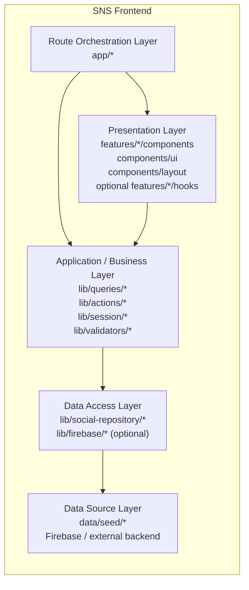

# 프론트엔드 레이어 정의

> 기준 문서: `docs/project-plan.MD`, `docs/plan/layout/architecture.md`, `docs/plan/layout/project-structure.md`, `docs/plan/layout/route-design.md`, `docs/plan/layout/design-system.md`, `docs/plan/api/api-design.md`

## 1. 목적

이 문서는 일반적인 `Component -> Hook -> Service -> Repository -> Server` 그림을 이 프로젝트의 실제 구조에 맞게 다시 정의한다.

이 프로젝트는 `Next.js 16 App Router + Server Component + Server Action` 기반이므로, 단순한 3계층보다 `라우트 조합`, `표현`, `애플리케이션`, `데이터 접근`, `데이터 소스`를 분리해서 보는 편이 더 정확하다.

## 2. 이 프로젝트의 권장 레이어 모델

## 3. 레이어별 정의

| 레이어 | 실제 위치 | 책임 | 여기 두면 안 되는 것 |
| --- | --- | --- | --- |
| Route Orchestration Layer | `app/*` | 라우트 진입, `layout/page`, `params/searchParams`, metadata, guarded route, modal slot 조합 | 공통 비즈니스 규칙, 데이터 소스 직접 접근 |
| Presentation Layer | `features/*/components`, `components/ui`, `components/layout`, optional `features/*/hooks` | 화면 렌더링, 폼 표시, 버튼/카드/리스트, 로컬 UI 상태, 낙관적 반응의 UI 껍데기 | repository 직접 호출, seed/Firebase 직접 접근, 영속 정책 |
| Application / Business Layer | `lib/queries/*`, `lib/actions/*`, `lib/session/*`, `lib/validators/*` | 화면 전용 read model 조합, mutation 흐름, 입력 검증, 인증/리다이렉트 규칙, 재검증 정책 | JSX 렌더링, raw 데이터 소스 접근을 UI에 노출 |
| Data Access Layer | `lib/social-repository/*`, `lib/firebase/*` | 데이터 접근 단일 진입점, seed와 실제 백엔드 교체, source adapter 캡슐화 | 라우트 의존, UI 의존 |
| Data Source Layer | `data/seed/*`, Firebase, 외부 백엔드 | mock/fixture, 실제 저장소, 외부 API/DB | UI 로직, 비즈니스 정책 |
| Shared Contract | `types/*` | 레이어 사이 공통 타입 계약 | 실행 로직 |

## 4. 그림 기준 매핑

| 그림 요소 | 이 프로젝트에서의 대응 위치 | 해석 기준 |
| --- | --- | --- |
| `Component` | `features/*/components`, `components/ui`, `components/layout` | 화면과 UI를 그리는 표현 단위 |
| `Hook` | `features/*/hooks` | 기본적으로 UI 전용 로컬 상태와 이벤트 조합만 담당 |
| `Service` | 별도 `services/` 폴더를 만들지 않고 `lib/queries`, `lib/actions`, `lib/session`, `lib/validators`로 분리 | 이 프로젝트의 비즈니스 레이어는 "서비스 개념"은 쓰되 "서비스 폴더"는 강제하지 않음 |
| `Repository` | `lib/social-repository/*` | 데이터 접근의 유일한 진입점 |
| `Mock` | `data/seed/*` | MVP 단계의 fake source. UI는 이 값이 mock인지 실제인지 몰라야 함 |
| `Server` | Firebase, 외부 백엔드, 공개 HTTP API가 필요할 때의 `route.ts` | 실제 영속 데이터 소스 |

## 5. 각 레이어를 어떻게 나눌지

### 5-1. Route Orchestration Layer

- `app`는 Next.js 규약을 따르는 레이어다.
- 여기서는 `layout.tsx`, `page.tsx`, `loading.tsx`, `error.tsx`, `not-found.tsx`, `@modal`, route group을 조합한다.
- `redirect`, `tab`, `selectedShortcode`, `isOverlayOpen`, `activeNav`처럼 URL에서 계산 가능한 값은 여기서 파생한다.
- 이 레이어는 "무엇을 보여줄지 조합"만 하고, "어떻게 저장하고 검증할지"는 아래 레이어로 넘긴다.

### 5-2. Presentation Layer

- 실제 화면, 카드, 리스트, 폼, 버튼, 헤더, 네비게이션은 이 레이어에 둔다.
- `features/*/components`는 기능 전용 표현을, `components/ui`는 공통 프리미티브를, `components/layout`는 공통 셸 조각을 담당한다.
- `hook`은 기본적으로 이 레이어 소속이다.
- 다만 hook 안에 검증, 영속 규칙, redirect 정책, 데이터 소스 분기까지 들어가기 시작하면 Presentation 범위를 벗어난 것이므로 `lib/actions`, `lib/queries`, `lib/validators`로 내려야 한다.

### 5-3. Application / Business Layer

- 이 레이어가 그림의 `Service`에 해당한다.
- 이 프로젝트에서는 별도 `services/` 폴더보다 역할별 분리가 더 중요하다.
- 조회 서비스는 `lib/queries/*`, 변경 서비스는 `lib/actions/*`, 인증/세션 서비스는 `lib/session/*`, 입력 규칙은 `lib/validators/*`가 맡는다.
- 즉 "서비스"는 개념이고, 실제 파일 위치는 `lib` 아래 역할별 모듈로 나눈다.

### 5-4. Data Access Layer

- 이 레이어는 그림의 `Repository`에 해당한다.
- `lib/social-repository/*`는 피드, 게시물, 프로필, 저장, 알림 같은 데이터 접근 계약을 소유한다.
- UI나 Action은 여기서 seed를 읽는지 Firebase를 읽는지 알지 못해야 한다.
- 데이터 소스 교체는 repository 뒤에서만 일어난다.

### 5-5. Data Source Layer

- `data/seed/*`는 현재 MVP의 mock source다.
- 이후 Firebase나 외부 백엔드가 들어오면 같은 자리의 실제 source가 된다.
- mock은 Presentation에 노출되지 않고 항상 repository 뒤에 숨어 있어야 한다.

## 6. 이 프로젝트에서의 실제 흐름

### 조회 흐름

`app/(main)/page.tsx`
-> `lib/queries/feed.ts`
-> `lib/social-repository/*`
-> `data/seed/*` 또는 실제 백엔드
-> `features/feed/components/*`

### 변경 흐름

`features/post-detail/components/post-actions.tsx`
-> `lib/actions/interaction.ts`
-> `lib/session/*` + `lib/validators/*`
-> `lib/social-repository/*`
-> `revalidatePath` / `redirect` / UI 반영

### URL 상태 흐름

`pathname / params / searchParams`
-> `app/*`
-> `features/*`

`activeTab`, `redirectTo`, `selectedShortcode`, `isOverlayOpen`을 전역 store로 복제하지 않는다.

## 7. 파일을 어디에 둘지 판단 기준

| 질문 | 두는 위치 | 예시 |
| --- | --- | --- |
| Next.js 라우트 진입점인가 | `app/*` | `page.tsx`, `layout.tsx`, `@modal` |
| 특정 기능 화면과 상호작용을 그리는가 | `features/<feature>/components` | `post-card.tsx`, `edit-profile-form.tsx` |
| 여러 기능에서 공통으로 쓰는 순수 UI인가 | `components/ui`, `components/layout` | `Button`, `ShellFrame` |
| 로컬 UI 상태를 묶는가 | `features/<feature>/hooks` | modal open, form draft, optimistic toggle |
| 조회용 화면 모델을 조합하는가 | `lib/queries/*` | `getFeedPageData` |
| 저장/수정/좋아요 같은 mutation 흐름인가 | `lib/actions/*` | `toggleLikeAction`, `updateProfileAction` |
| 세션, redirect, 입력 검증 규칙인가 | `lib/session/*`, `lib/validators/*` | `redirect` 검증, auth guard helper |
| 데이터 소스 접근과 교체를 숨기는가 | `lib/social-repository/*`, `lib/firebase/*` | `getFeed`, `toggleFollow` |
| mock/fake/raw fixture인가 | `data/seed/*` | users, posts, notifications |
| 레이어 사이 타입 계약인가 | `types/*` | `SocialPost`, `ProfileEditInput` |

## 8. 금지 규칙

- `components/*`와 `features/*/hooks`에서 `lib/social-repository/*`를 직접 import 하지 않는다.
- `app/*`에서 `data/seed/*`를 직접 읽지 않는다.
- `features/*`에서 Firebase SDK나 외부 데이터 소스를 직접 호출하지 않는다.
- URL에서 파생 가능한 값을 전역 store에 복제하지 않는다.
- 이 문서를 따르는 동안 별도 최상위 `services/` 폴더를 새로 만들지 않는다.
  - 서비스 책임은 이미 `lib/actions`, `lib/queries`, `lib/session`, `lib/validators`로 분리되어 있기 때문이다.
- 다른 feature 내부 구현을 직접 참조하지 않는다.

## 9. 최종 정리

이 프로젝트의 프론트엔드 레이어는 단순히 `Presentation / Business / Data Access` 3단으로만 보지 않고, 실제 구현에서는 아래처럼 이해하는 것이 가장 안전하다.

1. `app`은 Route Orchestration Layer다.
2. `features`와 `components`는 Presentation Layer다.
3. `lib/queries`, `lib/actions`, `lib/session`, `lib/validators`는 Application / Business Layer다.
4. `lib/social-repository`, `lib/firebase`는 Data Access Layer다.
5. `data/seed`와 미래 백엔드는 Data Source Layer다.
6. `types`는 모든 레이어를 연결하는 공통 계약이다.

즉, 그림의 `Component / Hook / Service / Repository / Mock / Server` 구조를 이 프로젝트에 옮기면 `app -> features/components -> lib -> repository -> seed/backend` 순서로 해석하면 된다.
